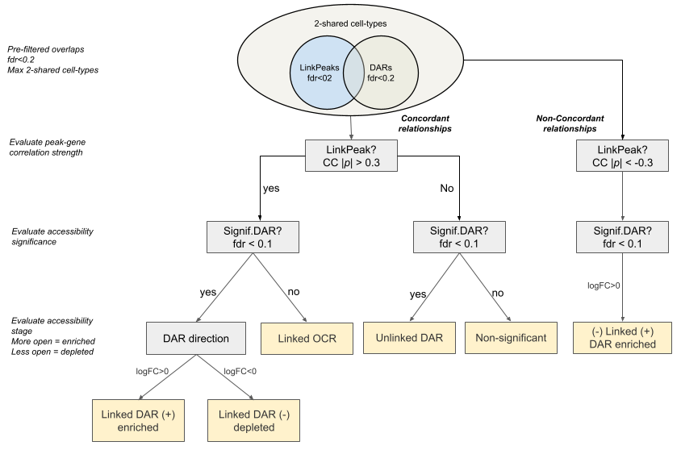

## Classification of Candidate Regulatory Elements by Category

---

## Summary of Candidate Regulatory Elements by Category

| **Category Name**              | **Interpretation**                                                                                                                                     | **Observed Count** | **Relevance**                                                                                 |
|:-------------------------------|:--------------------------------------------------------------------------------------------------------------------------------------------------------|:------------------:|:----------------------------------------------------------------------------------------------|
| **Linked_DAR (+) enriched**    | Concordant / Canonical **Positive Link** - Significant positive correlation and the region is significantly open.                                     | **706**            | **Primary Interest.** Canonical enhancer or promoter activity.                               |
| **Linked_DAR (-) depleted**    | Concordant / Canonical **Negative Link** - Significant correlation and the region is significantly closed.                                            | **657**            | **Primary Interest.** Canonical repressor / silencer activity.                               |
| **(-) Linked (+) DAR enriched**| **Non-Concordant Negative Link** - Significant negative correlation but the region is significantly open.                                              | *Missing or Low*   | **Exceptional Case.** Suggests complex regulatory loops or missed repressor elements.        |
| **Linked OCR**                 | Significant correlation but the region's accessibility change is not statistically differential.                                                       | **420**            | **Secondary Interest.** Regulatory link exists, but the element is not a strong DAR.         |
| **Unlinked DAR**               | Significant differential accessibility but no significant gene link found.                                                                             | **1068**           | **High Interest.** Potential for distal regulation or non-coding targets.                    |
| **Non-significant**            | Neither the LinkPeak nor the DAR change is significant.                                                                                                 | **354**            | **Baseline.** Represents regions where no regulatory change is observed.                     |

> **Note:**  
> The count for the non-concordant category *"(-) Linked (+) DAR enriched"* is missing in the current R output, likely indicating a value near zero.  
> This confirms that contradictory regulatory patterns — negative correlation with increased accessibility — are **rare** in this dataset.

---

## Thresholds applied for classification

- `thr_CC = 0.3` for correlation strength  
- `thr_DAR = 0.1` for accessibility significance  
- `thr_logFC = 0` for DARs direction  

---

## Linked File — Classified Overlaps

**File name:**  
[`overlaps_linkPeak_DARs_classified_thr_CC0.3_thr_DAR0.1.csv`](https://github.com/LieberInstitute/Hb_multiome/tree/acb22103843bfec1a538286d4a4c9d0a89e5c87c/processed-data/06_peak_calling/21_overlaping_FDRscores_TopHeatmap)

**Location:**  
`processed-data/06_peak_calling/21_classification_summary/`

---

## Overlaps by Cell Type (FDR = 0.2)

**Summary:**  
A total of **3,205 overlaps** were detected across **15 cell types**.  
The following breakdown shows the number of overlaps (rows) retained per cell type subset used in the classification analysis:

<!--
The following block was commented out in the original Rmd:

| **Category Name**              | **Logical Condition**                          | **Interpretation**                                                                                                       | **Observed Count (n)** | **Relevance**                                                                 |
|:-------------------------------|:-----------------------------------------------|:--------------------------------------------------------------------------------------------------------------------------|:------------------------|:------------------------------------------------------------------------------|
| **Linked_DAR (+) enriched**    | `sig_CC & sig_DAR & logFC > thr_logFC`         | Concordant / Canonical **Positive Link**: Significant positive correlation and the region is significantly open.         | **706**                | **Primary Interest.** Canonical enhancer / promoter activity.               |
| **Linked_DAR (−) depleted**    | `sig_CC & sig_DAR & logFC < -thr_logFC`        | Concordant / Canonical **Negative Link**: Significant correlation and the region is significantly closed.                | **657**                | **Primary Interest.** Canonical repressor / silencer activity.             |
| **(−) Linked (+) DAR enriched**| `(sig_CC < 0) & (sig_DAR & logFC > thr_logFC)`| **Non-Concordant Negative Link**: Significant negative correlation but the region is significantly open.                 | *Missing / Low*        | **Exceptional Case.** Complex regulation or missed repressor elements.      |
| **Linked OCR**                 | `sig_CC & !sig_DAR`                            | Significant correlation but the region’s accessibility change is not statistically differential.                          | **420**                | **Secondary Interest.** Weak DAR but linked region.                         |
| **Unlinked DAR**               | `!sig_CC & sig_DAR`                            | Significant differential accessibility but no significant gene link found.                                               | **1068**               | **High Interest.** Distal regulation or non-coding targets possible.        |
| **Non-significant**            | `TRUE`                                         | Neither the LinkPeak nor the DAR change is significant.                                                                  | **354**                | **Baseline.** Represents regions with no observed regulatory change.        |
-->

