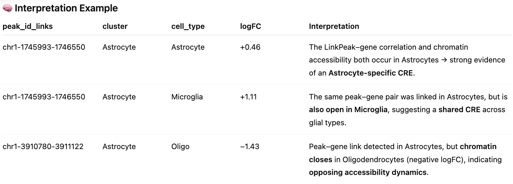

# Explore Overlapping LinkPeaks-DARs

Classifying peaks according to how many cell types share the same LinkPeak–DAR overlap. Each LinkPeak–DAR match is assigned to one of two categories:

-   Unique: overlap observed in only one cell type.
-   Shared: overlap observed in two or more cell types.

------------------------------------------------------------------------

  

#### Key Results

| File | Description |
|------------------------------------|------------------------------------|
| `overlaps_summary_linkPeak_DARs_unique_ct_FDR0.2.csv` | Summarizes all **LinkPeaks** that overlap **DARs** at *FDR = 0.2*, recording for each peak how many DARs and distinct cell types it overlaps. Peaks labeled **Unique** represent cell-type–specific regulatory elements. **Shared** peaks are accessible across multiple cell types, potentially marking common chromatin hubs or lineage-related programs. Typical counts: Shared = 3,636 vs Unique = 1,967 |
| `overlaps_unique_linkPeak_DARs_detail_FDR0.2.csv` | Detailed table of **unique LinkPeaks** overlapping DARs (*FDR = 0.2*), including full accessibility direction (`logFC`) and per-cell-type annotation. Used to characterize chromatin opening/closing dynamics within uniquely regulated elements. Provides fine-grained accessibility orientation for each unique LinkPeak–DAR pair |
|  |  |

Related plots:
https://github.com/LieberInstitute/Hb_multiome/tree/040a7df1fa0007ba88fddf1508efe93de0602deb/plots/06_peak_calling/20_explore_overlapping_linkpeaks_DARs 

------------------------------------------------------------------------

 

#### Columns description: `overlaps_summary_linkPeak_DARs_unique_ct_FDR0.2.csv`

 

|  |  |
|----------------------------|--------------------------------------------|
| `peak_id` | Genomic peak coordinate (`chr-start-end`) |
| `n_DARs` | Total number of DARs overlapping the given LinkPeak |
| `n_cell_types` | Number of distinct cell types sharing this LinkPeak–DAR overlap |
| `cell_types` | Semicolon-delimited list of all overlapping cell types |
| `overlap_type` | `"Unique"` if `n_cell_types = 1`; `"Shared"` otherwise |

---

 

#### Columns description: `overlaps_unique_linkPeak_DARs_detail_FDR0.2.csv`

| Column | Description |
|---------|--------------|
| `peak_id_links` | LinkPeak coordinate (`chr-start-end`) |
| `gene_name`, `gene_id` | Target gene metadata (inherited from LinkPeaks) |
| `cluster` | Cell group in which the `peak–gene` correlation (LinkPeaks) was originally computed |
| `cell_type` | Cell type used for the DARs analysis. For example, the cell type in which this peak was found to be significantly more or less accessible. Indicates the cell type where the same peak is differentially accessible (open/closed) |
| `logFC` | Log₂ fold-change of accessibility (from DARs) |
| `fdr_dars` | Adjusted p-value (FDR) from the differential accessibility test |
| `CCscore`, `FDR_CC` | Spearman correlation score and adjusted p-value from LinkPeaks |
| `accessibility` | Direction of accessibility: `"More"` (open) or `"Less"` (closed) |
| `overlap_type` | `"Unique"` (all rows in this file correspond to unique peaks) |

 

**In Context:**

Each row corresponds to one **LinkPeak–DAR overlap**:

- **`cluster`** is the cell group where the *link* (peak-gene correlation) was detected.  
- **`cell_type`** indicates the cell type where the same peak is *differentially accessible* (open or closed chromatin).  

Because a single LinkPeak can overlap multiple DARs from different cell types, the table contains **≈2,900 rows** instead of 1,967 unique peaks.  Each additional row represents a case where the **same regulatory region** is open or closed in another cell type.

 

  

 

#### Other related files: 

| File | Description |
|------------------------------------|------------------------------------|
| `overlaps_summary_linkPeak_DARs_shared_2ct_FDR2.0.csv` | Subset of the above, containing only LinkPeaks shared by exactly **two** cell types. Used to highlight cell-type pairs that co-regulate the same accessible regions. |
| `overlaps_summary_linkPeak_ALL_shared_top3_freq_ct_2.0.csv` | Summary of the top 3 most frequent cell-type combinations for each shared level (`n_cell_types = 2–10`). Useful for identifying recurring regulatory partnerships among cell types. |
| `overlaps_linkPeaks_unique_shared_detailed_FDR2.0.csv` | Long-format table listing each `peak_id × cell_type` pair with its classification (**Unique** or **Shared**). Each LinkPeak appears once per associated cell type. Used for cell-type–specific barplots. |
| `overlaps_summary_linkPeak_DARs_shared_2ct_FDR2.0.csv` | Same structure as the unique file, but restricted to **shared** LinkPeaks (`n = 2`) to explore chromatin regions accessible in two cell types. |
| `overlaps_summary_linkPeak_DARs_unique_ct_FDR2.0.csv` | Summary counts of all **unique and shared** overlaps aggregated by cell type, used in stacked barplots comparing Unique vs. Shared overlap frequencies. |

  

